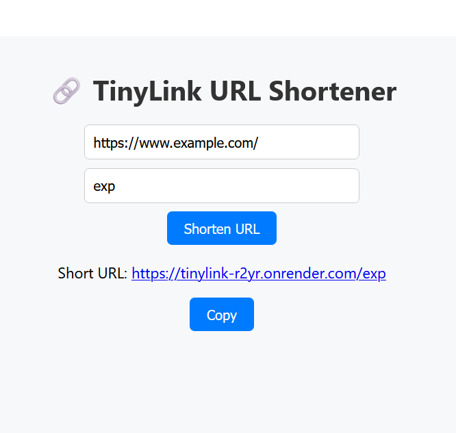
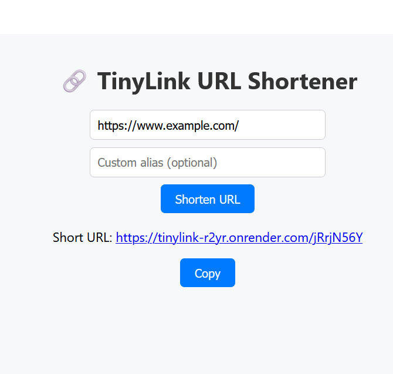

# TinyLink - URL shortner using NodeJS and React

It is a full-stack url shortner app using nodejs which lets user generate short links with custom aliases. 
Built with **MERN stack** and deployed using **Render(backend)** and **Vercel(frontend)**.

Live Demo: [visit TinyLink](https://tinylink-one.vercel.app/)
 ---
 
 ## Folder Structure:
 ```
📦tinylink
├── .gitignore
├── client
  ├── .gitignore
  ├── README.md
  ├── package-lock.json
  ├── package.json
  ├── src
    ├── App.css
    ├── App.js
    ├── index.css
    ├── index.js
├── config
  ├── db.js
├── models
  ├── Url.js
├── package-lock.json
├── package.json
├── routes
  ├── urlRoutes.js
├── server.js

 ©Markdown Tree generated by [GitTree](https://github.com/sachinz25/GitTree) (My another project)
---

## Getting Started(Local)

### 1.Clone the repository
```bash
git clone https://github.com/sachinz25/tinylink.git
cd tinylink
```
### 2.Install backend dependencies
```
nmp install
```
### 3.Connect MongoDB
create .env file in root with:
```
MONGO_URI=your_mongodb_connection_string
PORT=5000
```
### 4.start backend
```
node server.js
```
### 5.Run frontend
```
cd client
npm install 
npm start
```
## 📸 Screenshots

<div>
    
    
</div>

---

